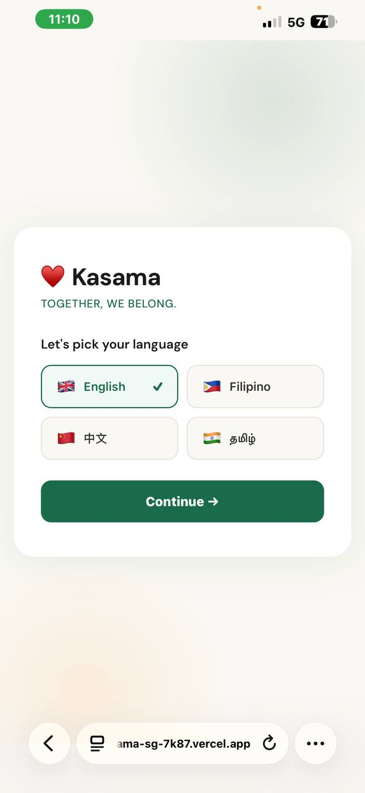
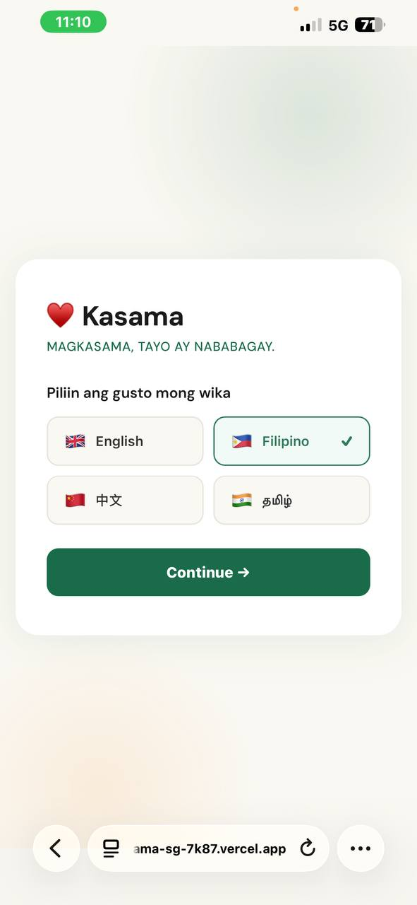
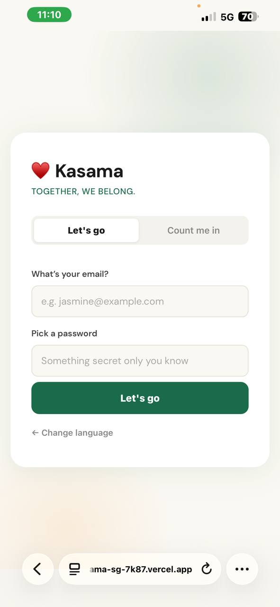
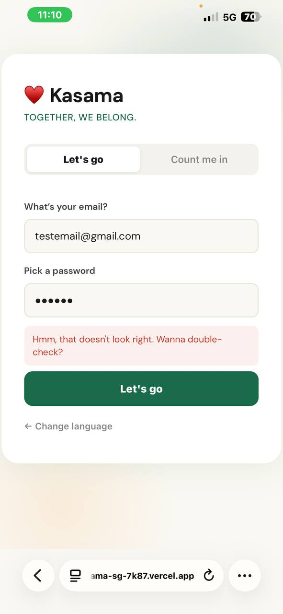
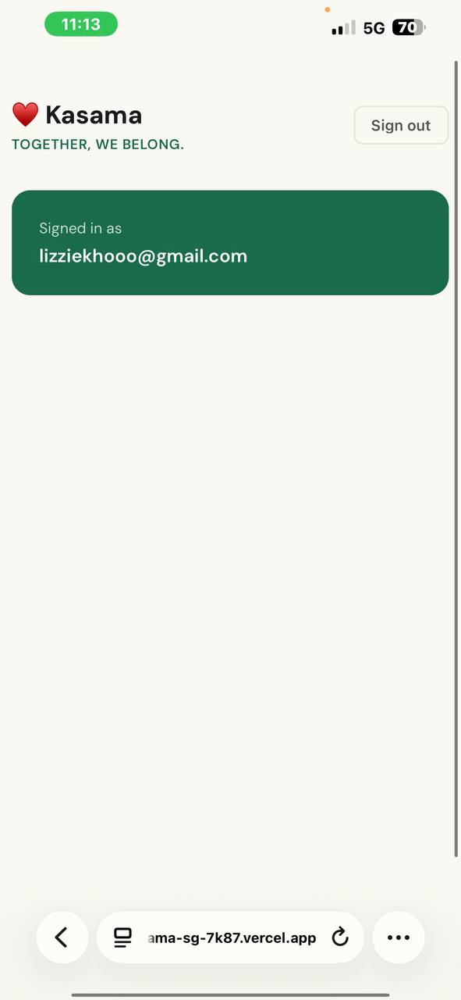
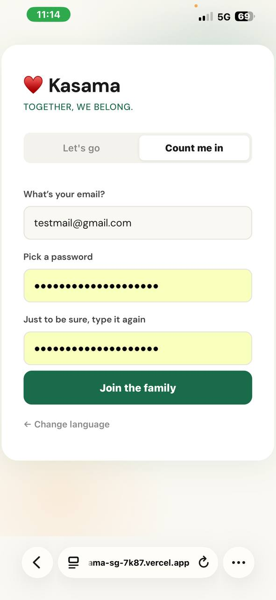

# Kasama 
### NUS Orbital 2026 (Artemis)

**Together, we belong.**


Kasama (Filipino for *together*) is a progressive web app that helps migrant domestic helpers feel a little less alone by making Singapore feel more like home. We felt that a lot of the information this group needs like community events, legal rights, emergency contacts, familiar food travels by word of mouth. We wanted to fix that to make sure that Singapore is a place where everyone can find their footing.

**Live app: [kasama-sg-7k87.vercel.app](https://kasama-sg-7k87.vercel.app)**

---

## Motivation

This app was born from personal experience. Both of us have lived with migrant domestic helpers in the past, hence we have witnessed firsthand the quiet struggles they face. Most things are travelled by word of mouth (which everyone doesn’t have equal access to), helpers may feel lost navigating an unfamiliar country, finding community, and simply feeling at home in a place that isn't theirs. Take the spaces that domestic helpers gather on Sundays — volleyball tournaments and community events do happen, but they're advertised only through Facebook posts or passed along by word of mouth. If you're new, or simply not in the right circle, you'd never know, hindering the process by which someone is integrated into that particular community. 

While doing research, we found that there is an existing app for migrant workers called FWMOM. However, the app, being tailored to migrant workers as a whole, does not cater to the specific social and physical needs of domestic helpers. In short, the app does not focus on the everyday things that make a foreign environment feel less foreign. We wanted to change that.

---

## Aim

Our goal is to build something accessible that brings those whispered recommendations into one place — connecting migrant workers with community events, places of worship, familiar food options, and the everyday things that make a foreign environment feel a little less foreign. 

Beyond the community, we also want to make information more accessible — from understanding their employment rights, to navigating the immigration journey, to knowing what legal protections are available to them. Many migrant workers are unaware of the rights and resources they are entitled to, and that knowledge gap can leave them vulnerable.
The app will support multilingual access through pre-translated content and structured phrasebooks, ensuring usability without reliance on costly real-time translation APIs.
In future iterations, we aim to explore lightweight community features such as curated discussions or FAQs, though this is not part of the initial MVP due to moderation and scalability considerations.
Emergency contacts and helpline information will also be surfaced prominently, so that help is always one tap away when it matters most. 

The system is designed as a lightweight, mobile-first Progressive Web App to ensure accessibility for users with limited device capabilities and connectivity.

---

## Features

### Language Selection
#### The first thing users see — choose your language before anything else

Migrant domestic helpers in Singapore come from all over the world, so we want to build Kasama for all languages. This is why the very first screen lets users pick from four languages (currently, with more to be added). The choice is saved to the device so the app remembers it on every visit (by localStorage)

<p align="center">
  
  
</p>

- Supports English, Filipino (Tagalog), 中文 (Chinese), and தமிழ் (Tamil)
- Switching to Filipino immediately updates the tagline, labels, and prompts to Tagalog
- Language preference is persisted in localStorage
- Built using react-i18next with pre-translated content 

---

### Authentication
#### Secure sign in and account creation, in your language

Using Supabase Auth, users can sign in to an existing account or create a new one from the same screen. 

<p align="center">
  
  
  
</p>

- Sign in with email and password
- Wrong credentials shows a friendly error message
- Successful login redirects to the home screen with the user's email shown
- Auth state persists across sessions, once signed in, users go straight to the home screen on return (by storing the session token in the browser's localStorage via Supabase Auth)
- Built on Supabase Auth

---

### Account Creation
#### Join the Kasama family

New users can create an account with email and password. The form includes a confirmation field ("Just to be sure, type it again") and validates that both passwords match before submitting.

<p align="center">
  
</p>

- Password confirmation field prevents typos
- All copy ("Join the family", "Just to be sure, type it again") is warm and approachable, not clinical
- Built on Supabase Auth with Row Level Security for privacy

---

## Project structure

```
kasama/
├── docs/    # doccumentation screenshots 
├── public/  # static assets
├── src/
│   ├── pages/
│   │   ├── AuthPage.jsx  # language picker + login or register
│   │   └── HomePage.jsx  
│   ├── lib/
│   │   └── supabase.js   # client setup
│   ├── i18n/
│   │   ├── index.js          
│   │   └── translations.js   # strings in EN, FIL, ZH, TA
│   ├── App.jsx   # routing + auth state
│   ├── main.jsx
│   └── index.css
├── .env.example
├── package.json
├── vercel.json
└── vite.config.js
```

---

## System architecture

The app has three layers:

**Frontend** — React PWA built with Vite, hosted on Vercel. Components are modular and independently developed. A service worker enables offline caching and PWA installability.

**Backend** — Supabase provides PostgreSQL, authentication, and storage with no custom server. Row Level Security protects personal data like salary logs.

**External services** — OpenStreetMap and Leaflet for free map tiles (Milestone 2); GitHub for version control and CI/CD; Vercel for global CDN delivery.

The frontend and backend are fully decoupled — the React app communicates with Supabase through API calls only.

---

## Tech stack

| | |
|---|---|
| Frontend | React 18 + Vite |
| Backend | Supabase (PostgreSQL + Auth) |
| Routing | React Router v6 |
| Multilingual | react-i18next |
| Maps | Leaflet + OpenStreetMap *(Milestone 2)* |
| Hosting | Vercel |
| PWA | vite-plugin-pwa |

We picked Supabase because it gives us auth, a database, and row-level security without needing a custom backend server. Leaflet + OpenStreetMap for maps because it's free and doesn't need an API key. Everything is optimised for low-end Android devices and limited data plans.

---

## Deployment

The app is deployed on Vercel and automatically redeploys on every push to the `main` branch.

---

## Roadmap

**Milestone 1 (current)** — language selection (EN/FIL/ZH/TA), login and registration with Supabase Auth, deployed PWA on Vercel

**Milestone 2** — curated map with Leaflet + OpenStreetMap, full rights and information library, help directory with tap-to-call, phrasebook, salary tracker

**Milestone 3** — audio phrasebook, stronger offline caching, community announcements, UI polish for low-end Android


